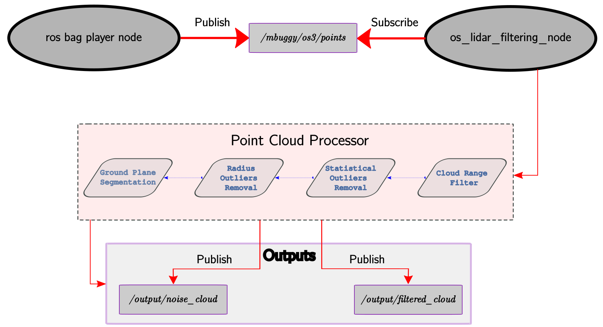
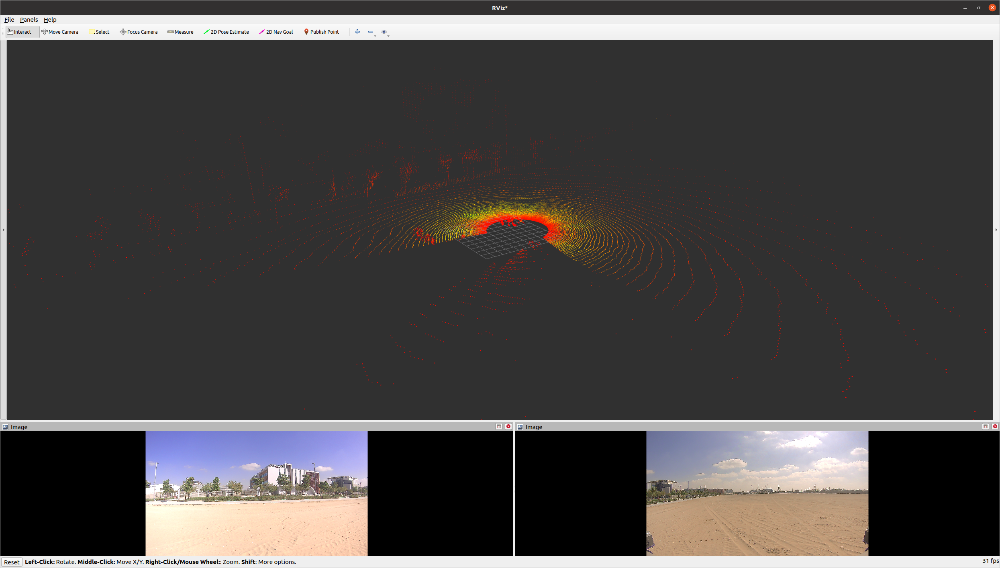
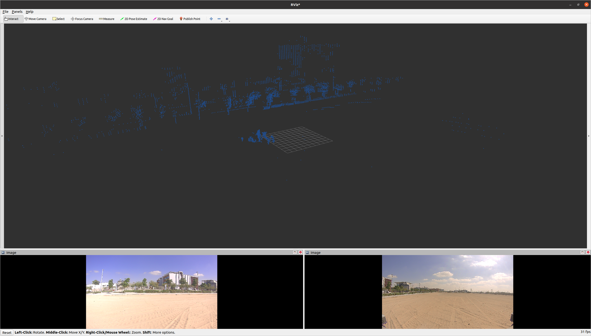
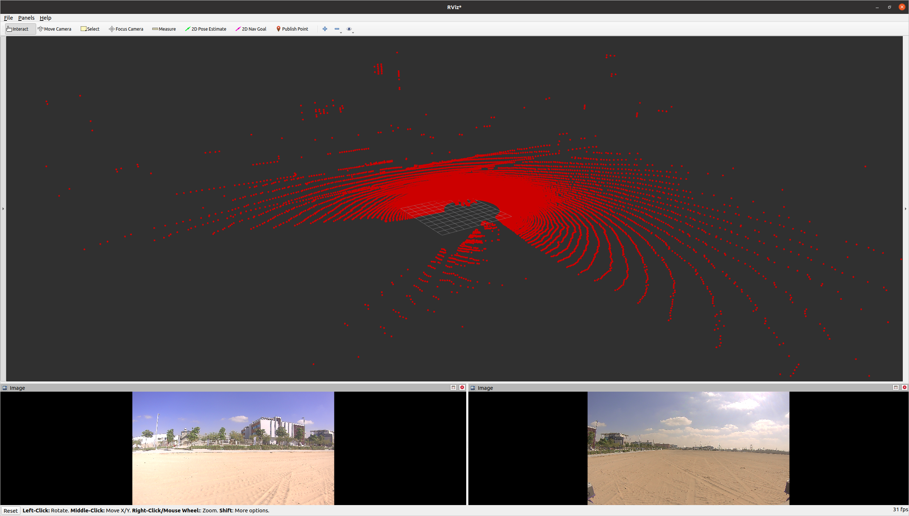
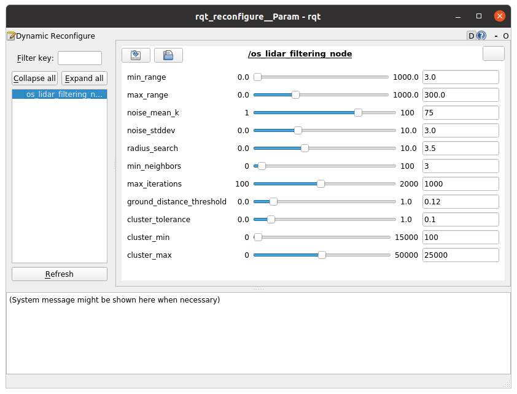

# "LiDAR Point Cloud: Noise Filtering and Ground Removal"

## Table of Contents
- [Overview](#overview)
- [Objectives](#objectives)
- [ROS Node Flow](#ros-node-flow)
- [Results](#results)
- [Documentation](#documentation)
- [Installation](#installation)
  - [Prerequisites](#prerequisites)
  - [Clone repo](#clone-repo)
  - [Build docker](#build-docker)
  - [Download the ros bag file](#download-the-ros-bag-file)
- [Usage](#usage)
  - [Run docker](#run-docker)
  - [Build the ROS Package](#build-the-ros-package)
  - [Run the filtering algorithm](#run-the-filtering-algorithm)
  - [Play the bag](#play-the-bag)
  - [For fine tuning, Run rqt dynamic configure](#for-fine-tuning-run-rqt-dynamic-configure)

## Overview
This project focuses on the development of a robust ground and noise filtering algorithm specifically designed for LiDAR point cloud data. The goal is to effectively remove ground points and noise while preserving important features such as trees and buildings. 

## Objectives
- Development of a ground and noise filtering algorithm on point cloud data using C++ and [Point Cloud Library (PCL)](https://pointclouds.org/).
- [ROS](https://www.ros.org/) package creation
- [Docker](https://www.docker.com/) packaging


## ROS Node Flow
1. The process begins with raw LiDAR data from the sensor.
2. This data is published on the ROS topic "/mbuggy/os3/points".
3. The lidar\_filter\_node subscribes to this topic and receives the raw point cloud data.
4. Inside the node, the filtering algorithms are applied:
	- Noise filtering removes noise and irrelevant points
	- Ground filtering removes ground points
5. The node then publishes two separate outputs:
	- "/output/filtered_cloud"
	- "/output/noise_cloud"


<p align="center">

</p>

## Results
To visually demonstrate the effectiveness of the LiDAR filtering algorithm, a comparison between the raw input point cloud and the final filtered output is presented in Figure~\ref{fig:final_results}. Additionally, the removed noise points are shown to illustrate what the algorithm has filtered out.

<figure>
	<figcaption>Raw Lidar Data</figcaption>
  	
</figure>


<figure>
	<figcaption>Filtered points</figcaption>
	
</figure>

<figure>
	<figcaption>Accumulated Removed noise</figcaption>
	
</figure>

## Documentation
For detailed documentation, please refer to the [Documentation](Documentation/TII_Autonomous_Vehicles_LiDAR_Filtering_Assignement_Documentation.pdf) file

## Installation

#### Prerequisites
1. docker, if you don't have you can install it following the docker [install instructions](https://docs.docker.com/get-docker/).


#### Clone repo
```bash
git clone https://github.com/MoTahoun/docker_tii_assessment.git
```

#### Build docker
The following command will build the [Dockerfile](Dockerfile) that encapsulate all the requirements to run the ros package
```bash
cd docker_tii_assessment
docker build -t lidar_filtering .
```

#### Download the ros bag file
Create a directory data
```bash
mkdir data
```
Then, copy the bag file inside that directory.

## Usage
### Run docker
In the terminal and directory
```bash
./docker_init.sh
```

### Build the ROS Package
```bash
cd tii_ws
catkin_make
source ~/.bashrc
```

### Run the filtering algorithm
Launch the package using a launch file
```bash
roslaunch os_lidar_filtering os_lidar_processor.launch
```

### Play the bag
Please download and put the bag file inside the directory workspacepackage: "/workspace/data/[BAG_NAME].bag"
Open other terminal and play the bag in a loop playback using the tag -l and paused using the tag --pause
```bash
docker exec -it lidar_filtering bash
rosbag play -l --pause /workspace/data/[BAG_NAME].bag
```
To start publishing bag's topice you should hit space or s to step

### For fine tuning, Run rqt dynamic configure 
<p align="center">

</p>
Open other terminal and play the bag
```bash
docker exec -it lidar_filtering bash
rosrun rqt_reconfigure rqt_reconfigure
```


<!---
#### Packages Installation
1. Install ROS Noetic following the steps in the following [link](https://wiki.ros.org/noetic/Installation/Ubuntu).
2. Install ROS Foxy following the steps in the following [link](https://docs.ros.org/en/foxy/Installation/Ubuntu-Install-Debians.html).
3. Install ros2 bridge package via debian (Tested only on ROS Foxy),
```bash
sudo apt-get install ros-foxy-ros1-bridge
```
#### Environment setup
1. Open the .bashrc file by any editor, ```gedit ~/.bashrc ```.
2. Look for the ``` source /opt/ros/noetic/setup.bash``` and add alias to it, ```alias noetic = "source /opt/ros/noetic/setup.bash; echo Noetic \(ROS1\) is active"```
3. Similarly, do the same for ROS Foxy, Look for the ``` source /opt/ros/foxy/setup.bash``` and add alias to it, ```alias foxy = "source /opt/ros/foxy/setup.bash; echo Foxy \(ROS2\) is active"```

#### Test the envirmontal setup
1. Open a new terminal and source the .bashrc file via ```source ~/.bashrc```, then test the alias for ros1 by typing ```noetic```, the following message should show up, ```Noetic (ROS1) is active```.
2. Similarly, open a new terminal to test ROS2, ```source ~/.bashrc```, then test the alias for ros2 by typing ```foxy```, the following message should show up, ```Foxy (ROS2) is active```.

### PC2 (Ubuntu 22.04)
1. Install ROS Humble following the steps in the following [link](https://docs.ros.org/en/humble/Installation/Ubuntu-Install-Debians.html).

#### Test the bridge between ROS1 and ROS2 on the same PC (PC1 ubuntu 20.04)
##### Example 1: run the bridge and the example talker and listener
Open 4 terminals (4 Shells)
First we start a ROS 1 roscore:
```bash
# Terminal A (ROS 1 only):
source ~/.bashrc
noetic
roscore
```

***

-->
